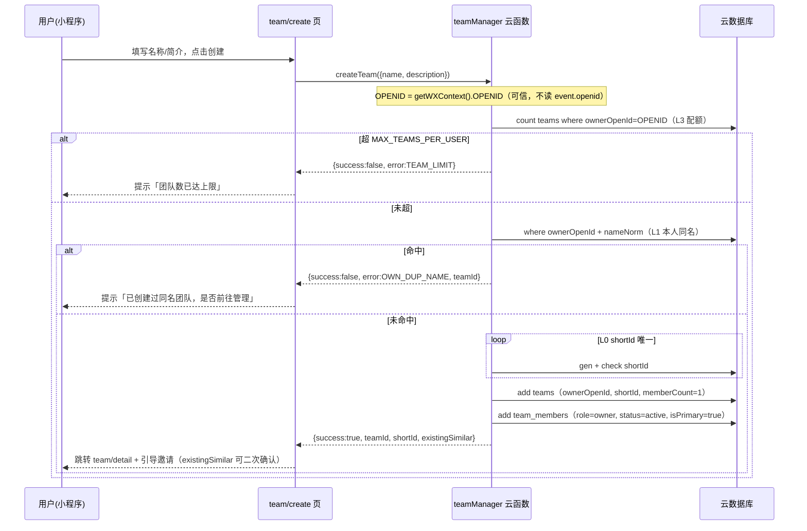
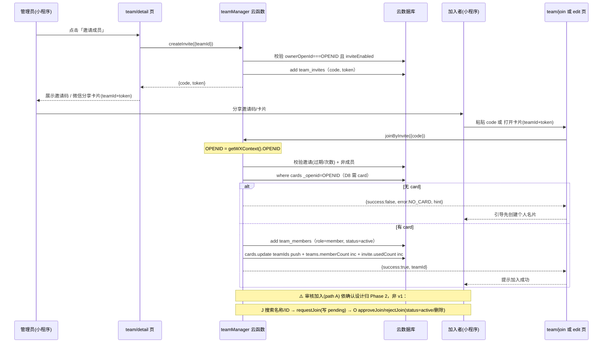

# Ncard Phase 1 团队租户 MVP — 增量系统设计与任务列表

> 文档状态：v1.0（架构设计，供工程师实现）
> 作者：架构师 高见远（Gao）
> 依据：`team-tenant-design.md` v0.4（D1–D12 已确认）+ `implementation-plan-v2.md`（Part B / §0 依赖）
> 前置依赖：Phase A 已落地 `users` 集合 + `getOpenId.ensureUser` + `app.ensureUser()/getUser()` + 云函数 `cloud.init({ env: cloud.DYNAMIC_CURRENT_ENV })`
> 范围声明：本文**只做架构设计与任务分解，不含实现代码**；所有 action 以伪代码骨架呈现。

---

## 1. MVP 范围锁定（含 P0 / P1）

### 1.1 纳入 v1（P0 — 必须）
| 能力 | 说明 | 对应决策 |
|---|---|---|
| **创建团队** | 表单创建 + 创建即 owner 且首个 active 成员；含 L0–L3 查重（配额/L1 本人同名硬拦截/L0 shortId 唯一/L2 软提示兜底） | D8/D9/D10/D12 |
| **邀请码加入（路径 B）** | owner 生成邀请码 + 微信分享卡片（卡片带 teamId+token）；joiner 凭码直接 active 加入 | D4 |
| **我的团队列表** | 展示我加入的团队、角色、徽章入口 | D1 |
| **团队详情/管理页** | 团队信息 + 成员列表 + 邀请入口 + 成员管理入口 + 退出 | D5 |
| **成员管理** | 移除成员（removeMember）、管理员编辑成员组织字段（updateMemberFields，仅 D2 字段） | D2/D5/D6 |
| **退出团队** | 成员 leaveTeam；owner 受保护（v1 不可退，须先转让/解散，转让属 v2） | D5 |
| **建卡时加入团队（路径 C）** | edit 页「加入团队」区块，粘贴邀请码加入；成功后 `cards.teamIds` 追加 | D1/D8 |
| **团队名片托管/关联（override）** | 个人 card 为真相源，按 `team_members.managedFields` 叠加覆盖层；preview 页轻量徽章（多团队并列） | D2/D6/D7 |

### 1.2 纳入 v1（P1 — 重要但可稍后）
| 能力 | 说明 |
|---|---|
| **微信分享卡片形态** | `onShareAppMessage` 携带 teamId+token，打开预填 team/join（邀请码形态为 P0，分享卡片为 P1） |
| **profile 入口 + agreement 说明** | profile 页「我的团队」入口；agreement 补充团队数据使用告知 |

### 1.3 暂不纳入 v1（已确认归 Phase 2 / v2，见 §9 待明确）
- **名称/ID 搜索加入 + 审核流**（`searchTeam` 仅用于创建期 L2 软提示；`requestJoin/approveJoin/rejectJoin` 归 Phase 2）—— ⚠️ 与任务书「审核」表述冲突，见 §9。
- **多管理员**、**转让团队（transferOwnership）**—— 依 D5 / 设计稿归 v2；⚠️ 与任务书「转让」冲突，见 §9。
- **分享图团队 Banner**、**openJoin 免审开关的 UI 消费**（随审核流在 Phase 2）、**企业认证/蓝 V**、**成员变动通知/统计**。
- `openJoin` 字段 v1 仍写入（默认 false）但不被任何 v1 流程消费（无审核流），留作前向兼容。

---

## 2. 数据模型（云集合）

> 通用约定：所有集合权限设为「**仅创建者可读写**」（与现有存储收紧策略一致）；**所有读写一律经 `teamManager` 云函数（admin 上下文）**，客户端不直接写库。云函数内显式写入 `_openid`（admin 上下文 add 不自动注入，教训来自 `getOpenId.ensureUser`）。

### 2.1 `teams`（团队）
```
_id:           string          // 内部ID（自动，不直接对外）
_openid:       string          // 显式 = ownerOpenId（匹配「仅创建者可读写」）
shortId:       string          // 对外「团队ID」，6-8 位易读码（如 TB7K2QD），唯一索引
name:          string          // 展示名（用户原样，不强制唯一）
nameNorm:      string          // 归一化名（L1/L2 比对用，见 §2.5）；存储保留原样 + 此副本
ownerOpenId:   string          // 业务权威归属（与 _openid 同源，来自 OPENID）
description:   string
logoUrl:       string          // v1 空
openJoin:      boolean         // 默认 false（v1 不消费，前向兼容）
inviteEnabled: boolean         // 默认 true
memberCount:   number          // 冗余计数，默认 1
createdAt:     number
```
**索引**：`shortId`(唯一)、`nameNorm`(模糊搜索/精确)、`ownerOpenId+nameNorm`(复合，L1 硬拦截)、`_id`(默认)。

### 2.2 `team_members`（成员关系 + 组织字段覆盖层）
```
_id:           string
_openid:       string          // = memberOpenId（成员本人可读自己的关联；owner 经云函数写他人记录）
teamId:        string
memberOpenId:  string
cardId:        string          // 对应个人名片ID（owner 未建卡可空，D8）
role:          'owner' | 'member'
status:        'pending' | 'active'   // v1 邀请加入直接 active；pending 留待 Phase 2 审核流
invitedBy:     string          // 邀请人 openid（邀请加入时填）
managedFields: {                // 仅 D2 所列组织字段
  company: string
  department: string
  position: string
  companyPhone: string
  companyAddress: string
  companyWebsite: string
  workEmail: string
}
isPrimary:     boolean          // 预留 v2 分享图 Banner，默认首个加入 true
joinedAt:      number
```
**索引**：`teamId+memberOpenId`(唯一，一人一队一条)、`memberOpenId`(查「我加入的团队」)。

### 2.3 `team_invites`（邀请凭证）
```
_id:           string
_openid:       string          // = createdBy
teamId:        string
code:          string          // 短邀请码（唯一索引）
token:         string          // 分享卡片校验串（随机）
createdBy:     string
expiresAt:     number          // 过期时间（默认 +7 天；0/空=不过期）
maxUses:       number          // 0=不限
usedCount:     number          // 默认 0
singleUse:     boolean         // 默认 false
```
**索引**：`code`(唯一)。

### 2.4 `cards` 改动（非破坏）
- 新增可选字段 `teamIds: string[]`（冗余，默认 []）；真相仍以 `team_members` 为准。
- 旧名片 `teamIds` 默认空，无需迁移。

### 2.5 关键语义说明
- **`_openid` vs 业务归属字段**：`teams._openid`/`team_members._openid`/`team_invites._openid` 仅用于「仅创建者可读写」权限匹配（显式写入创建者/成员 openid）；**业务归属与鉴权以 `ownerOpenId`/`memberOpenId` + 云函数 `OPENID` 为准**。
- **`nameNorm` 设计微调（解决设计稿内部矛盾）**：v0.4 §12.7 写「存储保留原样」却又 `where({ownerOpenId, name: normalized})`，二者冲突。本设计**新增 `nameNorm` 字段**存放归一化结果，`name` 保留用户原样；L1/L2 比对用 `nameNorm`，既满足「存储原样」又不破坏查重。属实现细化，未推翻任何已确认决策。
- **跨用户读**：非成员读团队信息一律走 `teamManager` 云函数（admin 上下文读），客户端不直连。云存储跨用户资源沿用既有 `resolveCloudUrls` 代理 + 「仅创建者可读写」策略。

---

## 3. 云函数设计：`teamManager`（单一函数 + action 路由）

风格对齐 `getOpenId`（先 `cloud.init({ env: cloud.DYNAMIC_CURRENT_ENV })` → `db` → `switch(action)` → 统一 `{success, data, error}` 返回 → try/catch 兜底）。所有 action **开头即取 `OPENID = cloud.getWXContext().OPENID`**，绝不读 `event.openid`。

### 3.1 v1 action 清单
| action | 权限 | 说明 |
|---|---|---|
| `createTeam` | 登录用户 | 含 L0–L3 查重 |
| `getMyTeams` | 登录用户 | 我加入的团队 + 我的角色/状态 |
| `getTeam` | 登录用户 | 团队详情 + 我的角色/状态 |
| `searchTeam` | 登录用户 | v1 仅用于创建期 L2 软提示（exact 同名）；Phase 2 扩展为加入搜索 |
| `createInvite` | owner | 生成邀请码+token |
| `joinByInvite` | 登录用户 | 凭码加入（D8 需 card） |
| `revokeInvite` | owner | 撤销邀请 |
| `listMembers` | 成员/owner | 成员列表 + 我的角色 |
| `updateMemberFields` | owner | 仅写 `managedFields`（D2） |
| `removeMember` | owner | 移除成员（不可移除 owner） |
| `leaveTeam` | 成员 | 退出（owner 受保护） |

> 以下 action 归 Phase 2/v2（v1 不实现）：`requestJoin`/`approveJoin`/`rejectJoin`（审核流）、`transferOwnership`（转让）。

### 3.2 骨架与关键 action 伪代码

```js
const cloud = require('wx-server-sdk')
cloud.init({ env: cloud.DYNAMIC_CURRENT_ENV })   // 先 init 再 database（铁律）
const db = cloud.database()
const _ = db.command
const MAX_TEAMS_PER_USER = 5

exports.main = async (event, context) => {
  const { OPENID } = cloud.getWXContext()        // 可信身份，绝不读 event.openid
  try {
    switch (event.action) {
      case 'createTeam':       return await createTeam(event, OPENID)
      case 'getMyTeams':       return await getMyTeams(OPENID)
      case 'getTeam':          return await getTeam(event, OPENID)
      case 'searchTeam':       return await searchTeam(event)
      case 'createInvite':     return await createInvite(event, OPENID)
      case 'joinByInvite':     return await joinByInvite(event, OPENID)
      case 'revokeInvite':     return await revokeInvite(event, OPENID)
      case 'listMembers':      return await listMembers(event, OPENID)
      case 'updateMemberFields': return await updateMemberFields(event, OPENID)
      case 'removeMember':     return await removeMember(event, OPENID)
      case 'leaveTeam':        return await leaveTeam(event, OPENID)
      default: return { success: false, error: 'UNKNOWN_ACTION' }
    }
  } catch (e) {
    return { success: false, error: (e && e.message) || String(e) }
  }
}

// 双重校验说明：客户端用 app.getUser()._openid 做 UI 分支（显不显示管理工具）；
// 云端用 OPENID 做唯一写授权。二者同源（皆微信注入），写权限只信云端。

async function createTeam(event, OPENID) {
  const { name, description = '', openJoin = false, inviteEnabled = true } = event
  if (!name || !name.trim()) return { success: false, error: 'NAME_REQUIRED' }
  const norm = normalizeName(name)
  // L3 配额
  const cnt = await db.collection('teams').where({ ownerOpenId: OPENID }).count()
  if (cnt.total >= MAX_TEAMS_PER_USER) return { success: false, error: 'TEAM_LIMIT' }
  // L1 本人同名硬拦截
  const dup = await db.collection('teams').where({ ownerOpenId: OPENID, nameNorm: norm }).get()
  if (dup.data.length) return { success: false, error: 'OWN_DUP_NAME', teamId: dup.data[0]._id }
  // L0 shortId 唯一
  let shortId
  do { shortId = genShortId() } while ((await db.collection('teams').where({ shortId }).count()).total > 0)
  const now = Date.now()
  const teamRes = await db.collection('teams').add({ data: {
    _openid: OPENID, shortId, name: name.trim(), nameNorm: norm, ownerOpenId: OPENID,
    description, logoUrl: '', openJoin, inviteEnabled, memberCount: 1, createdAt: now
  }})
  // 创建即 owner 且首个 active 成员
  await db.collection('team_members').add({ data: {
    _openid: OPENID, teamId: teamRes._id, memberOpenId: OPENID, cardId: '',
    role: 'owner', status: 'active', invitedBy: '', managedFields: emptyFields(),
    isPrimary: true, joinedAt: now
  }})
  // L2 软提示兜底：返回同名团队供前端二次确认
  const similar = await db.collection('teams')
    .where({ nameNorm: norm, _id: _.neq(teamRes._id) }).limit(10).get()
  return { success: true, data: { teamId: teamRes._id, shortId, existingSimilar: similar.data } }
}

async function createInvite(event, OPENID) {
  const { teamId, expiresAt, maxUses = 0, singleUse = false } = event
  const team = (await db.collection('teams').doc(teamId).get()).data
  if (!team) return { success: false, error: 'TEAM_NOT_FOUND' }
  if (team.ownerOpenId !== OPENID) return { success: false, error: 'NO_PERMISSION' }
  if (!team.inviteEnabled) return { success: false, error: 'INVITE_DISABLED' }
  let code
  do { code = genInviteCode() } while ((await db.collection('team_invites').where({ code }).count()).total > 0)
  const token = genToken()
  const res = await db.collection('team_invites').add({ data: {
    _openid: OPENID, teamId, code, token, createdBy: OPENID,
    expiresAt: expiresAt || Date.now() + 7 * 86400000, maxUses, usedCount: 0, singleUse
  }})
  return { success: true, data: { inviteId: res._id, code, token, teamId } }
}

async function joinByInvite(event, OPENID) {
  const { code } = event
  const inv = (await db.collection('team_invites').where({ code }).get()).data[0]
  if (!inv) return { success: false, error: 'INVITE_NOT_FOUND' }
  if (inv.expiresAt && Date.now() > inv.expiresAt) return { success: false, error: 'INVITE_EXPIRED' }
  if (inv.maxUses && inv.usedCount >= inv.maxUses) return { success: false, error: 'INVITE_USED_UP' }
  if ((await db.collection('teams').doc(inv.teamId).get()).data == null) return { success: false, error: 'TEAM_NOT_FOUND' }
  const exist = await db.collection('team_members').where({ teamId: inv.teamId, memberOpenId: OPENID }).get()
  if (exist.data.length) return { success: false, error: 'ALREADY_MEMBER' }
  // D8：加入需先有个人名片
  const card = (await db.collection('cards').where({ _openid: OPENID }).orderBy('createdAt', 'desc').limit(1).get()).data
  if (!card.length) return { success: false, error: 'NO_CARD', hint: '请先创建个人名片' }
  const now = Date.now()
  await db.collection('team_members').add({ data: {
    _openid: OPENID, teamId: inv.teamId, memberOpenId: OPENID, cardId: card[0]._id,
    role: 'member', status: 'active', invitedBy: inv.createdBy,
    managedFields: emptyFields(), isPrimary: false, joinedAt: now
  }})
  await db.collection('cards').doc(card[0]._id).update({ data: { teamIds: _.push(inv.teamId) } })
  await db.collection('teams').doc(inv.teamId).update({ data: { memberCount: _.inc(1) } })
  await db.collection('team_invites').doc(inv._id).update({ data: { usedCount: _.inc(1) } })
  return { success: true, data: { teamId: inv.teamId } }
}

async function listMembers(event, OPENID) {
  const { teamId } = event
  const me = (await db.collection('team_members').where({ teamId, memberOpenId: OPENID, status: 'active' }).get()).data
  if (!me.length) return { success: false, error: 'NOT_MEMBER' }
  const list = (await db.collection('team_members').where({ teamId }).orderBy('joinedAt', 'asc').get()).data
  return { success: true, data: { members: list, role: me[0].role } }
}

async function updateMemberFields(event, OPENID) {
  const { teamId, memberOpenId, managedFields } = event
  const team = (await db.collection('teams').doc(teamId).get()).data
  if (!team || team.ownerOpenId !== OPENID) return { success: false, error: 'NO_PERMISSION' }
  const mem = (await db.collection('team_members').where({ teamId, memberOpenId }).get()).data
  if (!mem.length) return { success: false, error: 'MEMBER_NOT_FOUND' }
  const patch = sanitizeManagedFields(managedFields)         // 仅放行 D2 七个组织字段
  await db.collection('team_members').doc(mem[0]._id).update({ data: { managedFields: patch } })
  return { success: true }
}

async function removeMember(event, OPENID) {
  const { teamId, memberOpenId } = event
  const team = (await db.collection('teams').doc(teamId).get()).data
  if (!team || team.ownerOpenId !== OPENID) return { success: false, error: 'NO_PERMISSION' }
  if (memberOpenId === OPENID) return { success: false, error: 'CANNOT_REMOVE_OWNER' }
  const mem = (await db.collection('team_members').where({ teamId, memberOpenId }).get()).data
  if (!mem.length) return { success: false, error: 'MEMBER_NOT_FOUND' }
  const m = mem[0]
  await db.collection('team_members').doc(m._id).remove()
  if (m.cardId) await db.collection('cards').doc(m.cardId).update({ data: { teamIds: _.pull(teamId) } })
  await db.collection('teams').doc(teamId).update({ data: { memberCount: _.inc(-1) } })
  return { success: true }
}

async function leaveTeam(event, OPENID) {
  const { teamId } = event
  const mem = (await db.collection('team_members').where({ teamId, memberOpenId: OPENID }).get()).data
  if (!mem.length) return { success: false, error: 'NOT_MEMBER' }
  const m = mem[0]
  if (m.role === 'owner') return { success: false, error: 'OWNER_CANNOT_LEAVE' }  // v1 owner 须先转让/解散(Phase 2)
  await db.collection('team_members').doc(m._id).remove()
  if (m.cardId) await db.collection('cards').doc(m.cardId).update({ data: { teamIds: _.pull(teamId) } })
  await db.collection('teams').doc(teamId).update({ data: { memberCount: _.inc(-1) } })
  return { success: true }
}

async function getMyTeams(OPENID) {
  const mem = (await db.collection('team_members').where({ memberOpenId: OPENID }).get()).data
  const teamIds = mem.map(m => m.teamId)
  if (!teamIds.length) return { success: true, data: { teams: [] } }
  const teams = (await db.collection('teams').where({ _id: _.in(teamIds) }).get()).data
  const map = {}; mem.forEach(m => map[m.teamId] = { role: m.role, status: m.status, isPrimary: m.isPrimary })
  const result = teams.map(t => ({ ...t, myRole: map[t._id].role, myStatus: map[t._id].status, isPrimary: map[t._id].isPrimary }))
  return { success: true, data: { teams: result } }
}

async function getTeam(event, OPENID) {
  const { teamId } = event
  const team = (await db.collection('teams').doc(teamId).get()).data
  if (!team) return { success: false, error: 'TEAM_NOT_FOUND' }
  const mem = (await db.collection('team_members').where({ teamId, memberOpenId: OPENID }).get()).data
  return { success: true, data: {
    team, myRole: mem.length ? mem[0].role : null, myStatus: mem.length ? mem[0].status : null
  } }
}

async function searchTeam(event) {
  const { keyword, exact = false, limit = 10 } = event
  if (!keyword || !keyword.trim()) return { success: false, error: 'KEYWORD_REQUIRED' }
  const norm = normalizeName(keyword)
  const cond = exact
    ? { nameNorm: norm }
    : { nameNorm: db.RegExp({ regexp: escapeRegExp(norm), options: 'i' }) }
  const list = (await db.collection('teams').where(cond).limit(limit).get()).data
  // L2 展示创建者昵称（来自 users，Phase B 才填充，v1 可能为空）
  const ownerIds = [...new Set(list.map(t => t.ownerOpenId))]
  const users = (await db.collection('users').where({ _openid: _.in(ownerIds) }).get()).data
  const nickMap = {}; users.forEach(u => nickMap[u._openid] = u.nickname || '')
  const teams = list.map(t => ({
    _id: t._id, shortId: t.shortId, name: t.name, ownerOpenId: t.ownerOpenId,
    ownerNick: nickMap[t.ownerOpenId] || '', memberCount: t.memberCount
  }))
  return { success: true, data: { teams } }
}

async function revokeInvite(event, OPENID) {
  const { inviteId } = event
  const inv = (await db.collection('team_invites').doc(inviteId).get()).data
  if (!inv || inv.createdBy !== OPENID) return { success: false, error: 'NO_PERMISSION' }
  await db.collection('team_invites').doc(inviteId).remove()
  return { success: true }
}

// 工具：normalizeName（D12c 全量归一）、genShortId、genInviteCode、genToken、emptyFields、sanitizeManagedFields、escapeRegExp
// normalizeName: 去首尾空格→折叠内部空格→全角转半角→中文标点归一→toLowerCase（仅比对用，存储保留原样）
```

---

## 4. 文件列表（新增 / 修改）

### 4.1 云函数（新增）
| 文件 | 职责 |
|---|---|
| `cloudfunctions/teamManager/index.js` | 单一云函数，action 路由；所有 §3 action 逻辑 + 工具函数；OPENID 鉴权 |
| `cloudfunctions/teamManager/package.json` | 依赖 `wx-server-sdk`；`main: index.js` |
| `cloudfunctions/teamManager/config.json` | 超时/内存配置（可选，建议 timeout 20s） |

### 4.2 页面（新建）
| 文件 | 职责 |
|---|---|
| `miniprogram/pages/team/list.{js,wxml,wxss,json}` | 我的团队列表 + 「创建/加入」入口 |
| `miniprogram/pages/team/create.{js,wxml,wxss,json}` | 创建团队表单 + L2 实时软提示（onInput 防抖 300ms → searchTeam exact） |
| `miniprogram/pages/team/detail.{js,wxml,wxss,json}` | 团队详情/管理（信息 + 成员列表 + 邀请 + 成员管理 + 退出 + 分享卡片 P1） |
| `miniprogram/pages/team/join.{js,wxml,wxss,json}` | 邀请码输入加入；打开分享卡片预填 teamId+token |
| `miniprogram/pages/team/member-edit.{js,wxml,wxss,json}` | 管理员编辑成员组织字段（仅 D2 字段可编辑） |

### 4.3 页面（修改）
| 文件 | 改动 |
|---|---|
| `miniprogram/pages/edit/*` | 增加「加入团队」区块（粘贴邀请码 → joinByInvite）；被托管字段加锁图标+禁用+「由 XX 团队管理」提示 |
| `miniprogram/pages/preview/*` | 姓名下方一排轻量徽章（多团队并列）；点徽章进入该团队「团队名片视图」（card + managedFields 覆盖层合并） |
| `miniprogram/pages/profile/*` | 增加「我的团队」入口 |
| `miniprogram/pages/agreement/*` | 补充「加入团队即授权团队管理你的组织字段」说明 |

### 4.4 工具 / 配置
| 文件 | 职责 |
|---|---|
| `miniprogram/utils/team.js` | 封装 `callTeamManager(action, data)`；身份获取 `getApp().getUser()._openid`（仅 UI 分支）；错误码→中文提示映射；override 合并 `mergeCardWithTeam(card, managedFields)` |
| `miniprogram/config/storage.js` | 已有，无需改（`resolveCloudUrl` 跨用户资源代理） |
| `miniprogram/app.js` | 已含 `ensureUser()/getUser()`，无需改；团队调用统一走 `utils/team.js` |

> 集合/索引/权限的创建在云控制台完成（或提供一次性初始化说明文档，见任务 T02）。

---

## 5. 程序调用流程（时序图）

### 图1：创建团队（含 L0–L3 查重）


### 图2：加入团队（邀请码 + 审核[Phase 2 标注]）


---

## 6. 有序任务列表（按实现顺序，标注依赖）

> 前置：Phase A 已就绪（users 集合 + ensureUser + DYNAMIC_CURRENT_ENV + app.ensureUser/getUser）。
> 优先级：P0=必须，P1=重要。

| 编号 | 目标 | 涉及文件 | 依赖 | 优先级 | 验收点 |
|---|---|---|---|---|---|
| **T01** | 云函数骨架：init + switch(action) + 通用返回/鉴权封装 + `getMyTeams`/`getTeam`/`searchTeam` | `cloudfunctions/teamManager/{index.js,package.json,config.json}` | Phase A | P0 | 可部署；OPENID 校验可用；`getMyTeams` 返回空；`searchTeam` 按 nameNorm 命中 |
| **T02** | 数据层准备：建 `teams`/`team_members`/`team_invites` 集合 + 索引（shortId 唯一、nameNorm、ownerOpenId+nameNorm、teamId+memberOpenId、memberOpenId、code 唯一）+ 权限「仅创建者可读写」+ `cards.teamIds` 字段说明 | 控制台 / 初始化说明文档 | 无（与 T01 可并行） | P0 | 集合/索引/权限生效；旧 card 兼容 |
| **T03** | `createTeam`：L3 配额 + L1 本人同名 + L0 shortId + nameNorm 写入 + L2 兜底返回 + 工具(normalizeName/genShortId/emptyFields) | `cloudfunctions/teamManager/index.js` | T01, T02 | P0 | 创建成功返 teamId/shortId；超配额报错；本人同名拦截；shortId 不撞 |
| **T04** | 邀请体系：`createInvite`/`joinByInvite`/`revokeInvite` + genInviteCode/genToken + D8 card 校验 + 计数/过期/限额 | `cloudfunctions/teamManager/index.js` | T01, T02 | P0 | owner 生成码→joiner 凭码 active 加入；无 card 报错；过期/超限拒绝；撤销生效 |
| **T05** | 成员管理：`listMembers`/`updateMemberFields`/`removeMember`/`leaveTeam` + 角色校验 + owner 保护 + sanitizeManagedFields | `cloudfunctions/teamManager/index.js` | T01, T02 | P0 | 列成员；owner 仅写 managedFields；移除后 card.teamIds 去除；owner 不可退/不可被踢 |
| **T06** | 客户端封装 `utils/team.js`：`callTeamManager` + 身份获取 `getUser()._openid`（UI 分支）+ 错误码中文映射 + `mergeCardWithTeam` 覆盖层合并 | `miniprogram/utils/team.js` | T01（action 名稳定） | P0 | 统一调用入口；错误中文提示；合并逻辑单测通过 |
| **T07** | 我的团队列表页 `team/list`：`getMyTeams` + 创建/加入入口 + 徽章展示 | `pages/team/list.*` | T01, T06 | P0 | 展示我加入的团队（角色/徽章）；入口可达创建/加入 |
| **T08** | 创建团队页 `team/create`：表单 + L2 实时软提示（onInput 防抖→searchTeam exact）+ 提交 createTeam | `pages/team/create.*` | T03, T06, T01(searchTeam) | P0 | 实时查重提示；提交成功跳 detail；配额/同名拦截提示 |
| **T09** | 团队详情页 `team/detail`：`getTeam` + `listMembers` + 邀请入口 + 成员管理入口 + 退出 | `pages/team/detail.*` | T01, T05, T04, T06 | P0 | 展示信息/成员；owner 见管理工具；member 见退出 |
| **T10** | 加入团队页 `team/join`：邀请码输入 → joinByInvite；无 card 引导建卡 | `pages/team/join.*` | T04, T06 | P0 | 粘贴码加入成功；无卡提示引导 |
| **T11** | 成员字段编辑页 `team/member-edit`：`updateMemberFields` 仅组织字段 | `pages/team/member-edit.*` | T05, T06 | P0 | 仅 D2 七字段可编辑；提交生效；其余字段不可见/禁用 |
| **T12** | 卡片托管/关联与预览呈现：edit 页「加入团队」区块 + preview 页徽章 + 覆盖层合并展示 + cards.teamIds 维护 | `pages/edit.*`, `pages/preview.*`, `utils/team.js` | T04, T06 | P0 | edit 可粘贴邀请码加入；preview 显示徽章；点徽章看团队名片视图 |
| **T13** | 微信分享卡片（P1）：detail `onShareAppMessage` 带 teamId+token；join 页接收预填 | `pages/team/detail.*`, `pages/team/join.*` | T04, T10 | P1 | 转发卡片携带参数；打开可加入 |
| **T14** | profile 入口 + agreement 说明（P1）：profile「我的团队」入口；agreement 补团队数据告知 | `pages/profile.*`, `pages/agreement.*` | T07 | P1 | profile 可见入口；agreement 有说明 |
| **T15** | 安全/权限回归与联调：确认所有写操作仅 OPENID 鉴权、集合权限、跨用户读经云函数 | 全量 | T01–T14 | P1 | 越权写被拒；非成员读受限；L2 昵称为空 gracefully |

---

## 7. 依赖包列表
```
- wx-server-sdk  ^2.6.3   // teamManager 云函数唯一第三方依赖（cloud.init / database / getWXContext）
- 小程序端：无新增 npm 依赖（原生小程序 + 现有 MUI/Tailwind 等价样式体系沿用）
- 构建/部署：微信开发者工具「上传并部署：云端安装依赖」
```
> 注：`teamManager` 与 `getOpenId` 同享 `wx-server-sdk`；`package.json` 需声明 `wx-server-sdk` 及 `main: index.js`。

---

## 8. 共享知识（跨文件约定）

1. **身份获取（双重校验）**
   - 客户端：`const me = getApp().getUser()` → `me._openid` 仅用于 **UI 分支判断**（是否显示管理工具、当前角色），**不用于写授权**。
   - 云函数：`const { OPENID } = cloud.getWXContext()` 是**唯一可信身份**；所有 owner/member 校验以此为准，**绝不读 `event.openid`**（安全铁律）。
   - 二者同源（皆微信注入），写权限只信云端 → 即「客户端决定显示什么，云端决定能不能写」。

2. **错误处理约定（云函数统一返回）**
   - 成功：`{ success: true, data: {...} }`
   - 失败：`{ success: false, error: 'ERROR_CODE' }`（可附 `hint`/`teamId` 等业务字段）
   - 客户端 `utils/team.js` 集中映射 `ERROR_CODE → 中文 toast`；不把原始 error 透传用户。

3. **列表/分页约定**
   - v1 团队规模小，`getMyTeams`/`listMembers`/`searchTeam` 默认 `limit(10~50)`，暂不实现游标分页；后续如需再补 `skip`/`lastId`。
   - `memberCount` 为冗余计数，写操作（加入/退出/移除/撤销不计数）用 `_.inc` 维护，避免全量 count。

4. **命名规范**
   - action 名小驼峰动词开头（`createTeam`/`joinByInvite`）；错误码全大写下划线（`TEAM_LIMIT`/`NO_CARD`）。
   - 云集合字段小驼峰；对外 `shortId`、内部 `_id` 不混用。
   - 页面路径 `pages/team/*` 统一前缀，组件/工具不污染全局。

5. **覆盖层（override）合并规则**
   - 个人 `card` 为真相源；展示某团队名片时，用 `team_members.managedFields` 中**非空字段**覆盖 card 同名字段；空值不覆盖。
   - 个人字段（姓名/私人手机/微信/邮箱/地址）**永不被团队覆盖**（D2）。

6. **隐私/合规**
   - 团队字段编辑/加入需在 `agreement` 告知；沿用 `__usePrivacyCheck__: true` + `showPrivacyError`。
   - 邀请码/分享卡片不包含敏感个人信息，仅 teamId+token。

7. **页面启动约定**
   - 团队页 `onLoad` 可 `await getApp().ensureUser()`（幂等、缓存 Promise）后再首调 `teamManager`；读 `getUser()._openid` 做 UI 分支。

---

## 9. 待明确事项（需主理人/用户拍板，未擅自扩大范围）

1. **「审核加入」是否纳入 v1？**（与任务书表述冲突）
   - 任务书建议覆盖「加入团队（审核/邀请）」；但确认设计 `team-tenant-design.md` B10 / `implementation-plan-v2.md` B9 明确将「名称/ID 搜索 + 审核流（`requestJoin`/`approveJoin`/`rejectJoin`）」列为 **Phase 2**，且 D12 的 L2 软提示是在**创建环节**用 `searchTeam`，并非加入审核。
   - **当前 v1 仅做「邀请码加入」（路径 B）**。`searchTeam` action 已实现，但仅用于创建期 L2 提示，不暴露加入搜索 UI。
   - 若主理人坚持 v1 含审核流，需追加：`requestJoin`（写 pending）+ `approveJoin`/`rejectJoin`（owner UI）+ 加入搜索 UI + `openJoin` 开关消费，约 +3~4 任务，并引入 `status:pending` 的全流程。

2. **「转让团队」是否纳入 v1？**（与任务书「转让」冲突）
   - 确认设计 D5「v1 仅创建者=管理员」、`teamManager` 设计稿将 `transferOwnership` 标 **v2**；且 v1 已约束「owner 不可退/不可被踢」，转让无承接方设计。
   - **当前 v1 不做转让**，owner 退出受限仅给错误提示。
   - 若纳入 v1，需新增 `transferOwnership` action + UI + 「新 owner 接管 teams.ownerOpenId 与 team_members.role」逻辑，约 +2 任务。

3. **L2 软提示的「创建者昵称」来源**：依赖 `users.nickname`，而昵称填充属 **Phase B**（资料完善 UI）。v1 昵称大概率为空 → L2 提示仅显示 shortId/成员数，昵称留空。`searchTeam` 已做空值兜底，无需阻塞；是否要在 v1 临时用 `visitor_profiles` 昵称？建议：**v1 留空**，等 Phase B 打通，不额外耦合。

4. **`openJoin` 字段**：v1 创建时按默认 false 写入但不被消费（无审核流）。是否在创建/设置页提前暴露开关？建议 **v1 不暴露 UI**，随 Phase 2 审核流一并接入，避免半完成功能。

5. **邀请默认有效期/次数**：设计稿未定死。建议默认 `expiresAt = now+7d`、`maxUses=0`（不限）、`singleUse=false`；是否需前端可配置？建议 v1 固定默认值，UI 不暴露高级选项。

6. **「建卡时加入」（路径 C）的时序细节**：edit 页粘贴邀请码加入时，card 可能尚未保存。建议流程：先确保 card 已保存拿到 `cardId` → 再 `joinByInvite`（云函数已用 `_openid` 查 card，故实际可由云函数自动定位 card，无需前端传 cardId）。当前 `joinByInvite` 伪代码即按 `_openid` 自动取 card，前端只需传 `code`。请确认此「云函数自动定位 card」方式符合预期（避免前端伪造 cardId）。

7. **shortId / 邀请码字符集**：建议 shortId 用 `TB` 前缀 + 易读大写字母数字（去 0/O/1/I 混淆），邀请码纯数字/字母 6 位。是否需前缀区分？待定，建议 shortId 带 `TB` 前缀提升辨识度。

---

> 交付说明：本设计为 Phase 1 团队租户 MVP 的增量架构与任务分解，严格对齐 `team-tenant-design.md` v0.4（D1–D12）与 `implementation-plan-v2.md` Part B，未推翻任何已确认决策；§9 所列冲突项保留给主理人/用户最终拍板，未擅自纳入 v1。

## 10. 范围拍板记录（2026-08-14，主理人齐活林确认）
- **§9.1 审核加入**：保持设计稿 —— v1 仅邀请码加入，审核流（`requestJoin`/`approveJoin`/`rejectJoin` + 加入搜索 UI + `openJoin` 消费）归 **Phase 2**。
- **§9.2 转让团队**：保持设计稿 —— v1 不做转让（`transferOwnership` 归 **v2**），owner 退出受限仅返回错误提示。
- **§9.3–§9.7** 按架构师推荐默认值采纳：L2 创建者昵称 v1 留空、`openJoin` 不暴露 UI、邀请默认 7 天/不限次、云函数按 `_openid` 自动定位 card（防伪造）、shortId 带 `TB` 前缀。
