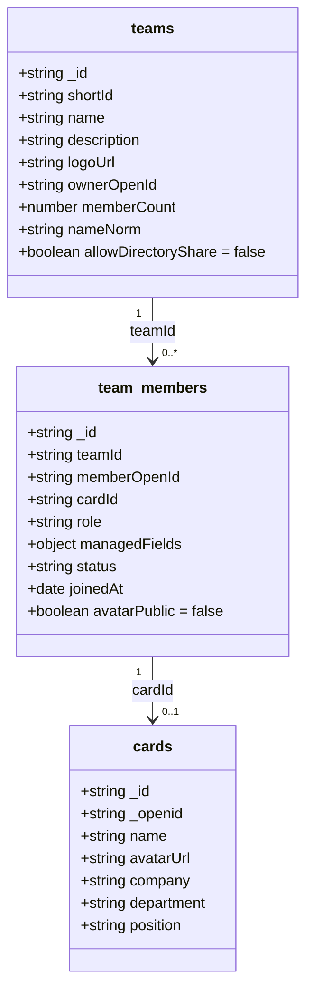
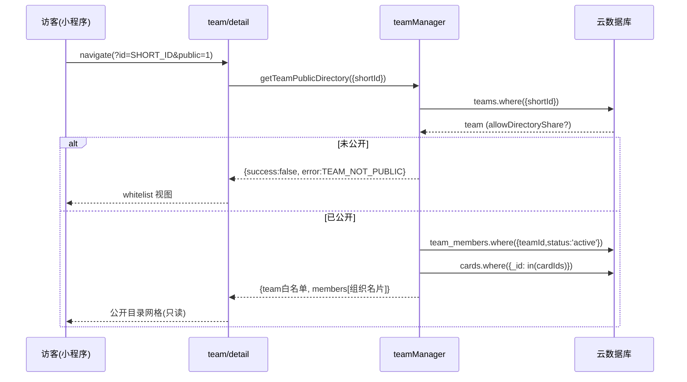
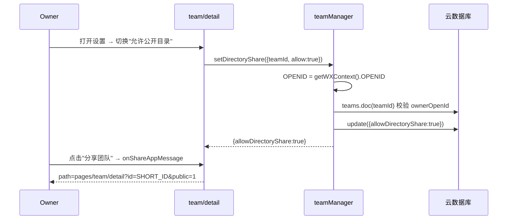

# Ncard 团队公开目录 + 整组分享 + 公众号挂载 · 详细设计稿

> 作者：Bob（架构师）｜范围：仅设计（数据模型 + 云函数伪代码 + 页面结构 + 接口契约 + 安全边界），不含实现代码。
> 关联决策：阶段一（导航瘦身，纯前端）/ 阶段二（公开目录 + 整组分享 + 公众号挂载，需新增云函数与字段）。
> 现有约束已采信：微信小程序原生 + 云开发；`cloud.init({env: cloud.DYNAMIC_CURRENT_ENV})` 必须在 `cloud.database()` 之前；所有写操作以 `cloud.getWXContext().OPENID` 为唯一可信身份；集合权限「仅创建者可读写」+ 云函数 admin 上下文读写。

---

## 0. 设计目标与总览

| 维度 | 阶段一（纯前端） | 阶段二（前端 + 云函数 + 字段） |
|---|---|---|
| 导航瘦身 | 首页加入口；preview 徽章直达；edit 弱化深链 | — |
| 公开目录 | — | `teams.allowDirectoryShare`（默认 false）+ 新 action `getTeamPublicDirectory` |
| 整组分享 | — | `team/detail` `onShareAppMessage` → `pages/team/detail?id=SHORT_ID&public=1` |
| 公众号挂载 | — | 文档化路径 `pages/team/detail?id=SHORT_ID&public=1` |

---

## 1. 改动文件清单

### 1.1 云函数（阶段二）
| 文件 | 改动类型 | 说明 |
|---|---|---|
| `cloudfunctions/teamManager/index.js` | 修改 | `switch(event.action)` 新增 `getTeamPublicDirectory`、`setDirectoryShare` 两个分支；`createTeam` 写入 `allowDirectoryShare:false`；`getTeam` 对非成员白名单保持不变（不泄漏 `allowDirectoryShare`） |

### 1.2 前端（阶段一 + 阶段二）
| 文件 | 阶段 | 改动 |
|---|---|---|
| `pages/index/index.js` / `.wxml` / `.wxss` | 阶段一 | 新增「我的团队」入口，跳 `/pages/team/list` |
| `pages/preview/preview.js` / `.wxml` | 阶段一 | 团队徽章 `bindtap` 直达对应 `team/detail`（替换原"弹托管视图"） |
| `pages/edit/edit.js` / `.wxml` | 阶段一 | 弱化/移除「我的团队 ›」深链，保留「加入团队」区块 |
| `pages/team/detail.js` / `.wxml` / `.wxss` | 阶段二 | 新增公开模式（只读目录网格）、`public=1` 参数处理、owner 专属分享按钮、`onShareAppMessage` |
| `utils/team.js` | 阶段二 | 新增 `callTeamManager('getTeamPublicDirectory', ...)` 封装；`TEAM_ERROR_MESSAGES` 增加 `TEAM_NOT_FOUND` / `TEAM_NOT_PUBLIC` |

> 说明：`pages/team/list`、`pages/team/detail` 管理视图（成员列表/移除/邀请）在阶段一已存在，阶段二仅扩展"公开模式"分支，不改动既有管理逻辑。

---

## 2. 数据模型变更

### 2.1 `teams` 集合 · 新增字段
```ts
allowDirectoryShare: boolean   // 是否允许进入公开团队目录。默认 false（隐私优先）。仅 owner 可切换。
```
- 写入位置：`createTeam` 时显式写 `allowDirectoryShare: false`（即便历史文档未列此字段，旧文档该值为 `undefined`，按"非 true 即私有"处理，无需回填迁移）。
- 读取：仅 owner/成员在 `getTeam` 的"授权视图"中可见该开关；**非成员白名单视图不返回该字段**（避免泄漏"是否公开"）。

### 2.2 `team_members` 集合 · 新增字段（建议）
```ts
avatarPublic: boolean   // 成员是否允许在公开目录展示头像。默认 false（隐私优先）。
```
- **建议采纳**：头像属半私人视觉信息，应默认不公开，由本人/owner 显式开启。
- 改写入点：`updateMemberFields`（本人改自己）与 owner 管理入口增加 `avatarPublic` 开关；`joinByInvite` 默认写入 `avatarPublic: false`。
- 不引入"逐字段公开开关"（如 `publicFields` 数组）——阶段二仅固定公开 `name/position/company/department` 子集，避免权限面爆炸，后续可扩展。

### 2.3 字段关系图（classDiagram）


### 2.4 D2 七组织字段（决策已定，复用）
`managedFields` 仅允许：`company, department, position, companyPhone, companyAddress, companyWebsite, workEmail`。
- 个人字段（姓名、私人手机/微信/邮箱/地址）**始终归本人**，团队不可改。
- **公开目录默认仅暴露组织身份子集**：`name`（来自 card）、`position`、`company`、`department`（优先 managedFields，回退 card）。`companyPhone/companyAddress/companyWebsite/workEmail` 阶段二**不公开**（后续可做成 opt-in）。

---

## 3. `getTeamPublicDirectory` 接口契约 + 完整伪代码

### 3.1 契约
| 项 | 值 |
|---|---|
| action | `getTeamPublicDirectory` |
| 入参 | `{ teamId?: string, shortId?: string }`（二选一；优先 shortId） |
| 鉴权 | **无需登录、无需成员身份**；admin 上下文只读。不使用 `OPENID` 做任何过滤 |
| 返回 | `{ success, data, error }` |
| `data.team` | 白名单：`{ _id, shortId, name, description, logoUrl, memberCount }` |
| `data.members[]` | 每成员：`{ memberId, name, position, company, department, avatarUrl }`（剔除一切私人/敏感字段） |

### 3.2 错误码（复用现有 `TEAM_ERROR_MESSAGES` 风格）
| 错误码 | 含义 | 触发 |
|---|---|---|
| `TEAM_NOT_FOUND` | 团队不存在 | shortId/_id 解析无结果 |
| `TEAM_NOT_PUBLIC` | 团队未公开 | `allowDirectoryShare !== true` |
| `INVALID_PARAM` | 参数缺失 | 既无 teamId 也无 shortId |

### 3.3 伪代码（伪代码，非生产）
```js
// ===== cloudfunctions/teamManager/index.js =====
// 写在 switch(event.action) 内：
case 'getTeamPublicDirectory':
  return await getTeamPublicDirectory(event)

case 'setDirectoryShare': {
  // owner 切换公开开关，仍需 OPENID 鉴权
  const { OPENID } = cloud.getWXContext()
  return await setDirectoryShare(event, OPENID)
}

// ===== 函数实现 =====
const PUBLIC_MANAGED = ['position', 'company', 'department']  // 公开的组织身份子集
const ALLOWED_KEYS   = ['memberId', 'name', 'position', 'company', 'department', 'avatarUrl']

async function getTeamPublicDirectory(event) {
  const { teamId, shortId } = event
  if (!teamId && !shortId) {
    return { success: false, data: null, error: 'INVALID_PARAM' }
  }

  const db = cloud.database()
  // —— shortId 解析（若传 shortId 先按 shortId 查 teams）——
  let team
  if (shortId) {
    const r = await db.collection('teams').where({ shortId }).limit(1).get()
    team = r.data && r.data[0]
  } else {
    const r = await db.collection('teams').doc(teamId).get()
    team = r.data
  }
  if (!team) return { success: false, data: null, error: 'TEAM_NOT_FOUND' }

  // —— allowDirectoryShare 校验（隐私铁律：默认私密）——
  if (team.allowDirectoryShare !== true) {
    return { success: false, data: null, error: 'TEAM_NOT_PUBLIC' }
  }

  // —— 取 active 成员 ——
  const mRes = await db.collection('team_members')
    .where({ teamId: team._id, status: 'active' })
    .get()
  const members = mRes.data || []

  // —— 批量取 cards（注意 in 查询上限 20，>20 需分批）——
  const cardIds = members.map(m => m.cardId).filter(Boolean)
  const cardsMap = {}
  if (cardIds.length) {
    // 简化写法：实际需按 20 一组分页 get
    const cRes = await db.collection('cards')
      .where({ _id: db.command.in(cardIds) }).get()
    cRes.data.forEach(c => { cardsMap[c._id] = c })
  }

  // —— 组装"组织名片"，严格白名单 sanitize ——
  const directory = members.map(m => {
    const card = m.cardId ? cardsMap[m.cardId] : null
    const mf = (m.managedFields || {})
    // 组织字段：managedFields 非空优先（override），回退 card 同名
    const org = {
      memberId: m._id,
      name:        (card && card.name) || '匿名成员',
      position:    mf.position    || (card && card.position)    || '',
      company:     mf.company     || (card && card.company)     || '',
      department:  mf.department  || (card && card.department)  || '',
      avatarUrl:   (m.avatarPublic === true && card) ? (card.avatarUrl || '') : '',
    }
    // 强制剔除：_openid / memberOpenId / cardId / phone / wechat / email / address /
    //          companyPhone / companyAddress / companyWebsite / workEmail
    return sanitize(org, ALLOWED_KEYS)
  })

  return {
    success: true,
    error: null,
    data: {
      team: {
        _id: team._id, shortId: team.shortId, name: team.name,
        description: team.description, logoUrl: team.logoUrl, memberCount: team.memberCount
      },
      members: directory
    }
  }
}

function sanitize(obj, allowed) {
  const out = {}
  allowed.forEach(k => { out[k] = obj[k] || '' })
  return out
}

// ===== owner 切换公开开关 =====
async function setDirectoryShare(event, OPENID) {
  const { teamId, allow } = event
  const db = cloud.database()
  const t = (await db.collection('teams').doc(teamId).get()).data
  if (!t) return { success: false, data: null, error: 'TEAM_NOT_FOUND' }
  if (t.ownerOpenId !== OPENID) {
    return { success: false, data: null, error: 'NO_PERMISSION' }  // 复用现有无权限码
  }
  await db.collection('teams').doc(teamId).update({ data: { allowDirectoryShare: !!allow } })
  return { success: true, data: { allowDirectoryShare: !!allow }, error: null }
}
```

### 3.4 关键边界
- **shortId 解析顺序**：先查 `shortId`，命中即用其 `_id` 作为后续 `teamId`，保证分享链接 `?id=SHORT_ID` 与内部 `_id` 双路兼容。
- **>20 成员分页**：`db.command.in` 上限 20，成员多时需按 20 一组循环 `get`；或仅取公开所需最小字段。
- **`memberCount` 以 teams 冗余计数返回**，与 `members.length` 可能不一致（含非 active），公开视图以 `team.memberCount` 展示，网格以实际 `members` 渲染，二者可接受差异。

---

## 4. `team/detail` 公开模式页面结构

### 4.1 进入路径与视图判定（前端逻辑，非代码）
```
onLoad(options):
  id = options.id            // teamId 或 shortId
  isPublicParam = options.public === '1'
  // 1) 先取团队基础信息
  base = callTeamManager('getTeam', { id })        // 非成员→白名单；成员→授权视图
  isMember = base.data.membership === 'member'     // 由 getTeam 返回的成员态
  // 2) 判定视图模式
  if isPublicParam:
      mode = 'public'        // 强制只读目录（含 owner 预览自己的公开页）
  else if isMember:
      mode = 'manage'        // 既有管理视图
  else:
      // 非成员：探测是否公开
      pub = callTeamManager('getTeamPublicDirectory', { id })
      mode = pub.success ? 'public' : 'whitelist'   // whitelist=仅白名单+加入入口
```
- `mode` 存入 `this.data.viewMode`，`wxml` 用 `wx:if` 条件渲染。

### 4.2 三种视图结构
| 视图 | 触发 | 渲染内容 | 操作 |
|---|---|---|---|
| **manage（管理）** | 成员/owner | 成员列表（含「托管名片视图」徽章逻辑）、移除/编辑按钮、设置（公开开关）、分享 | owner 可见「分享团队」「设置公开」 |
| **public（公开目录）** | `public=1` 或 非成员访问已公开团队 | 团队头（白名单信息）+ **成员目录网格**：每个成员卡片仅显示 `name / position / company / department / avatar(if consented)` | **无任何管理/移除按钮**；owner 仍可见「分享」按钮（用于复制/转发自己的公开页） |
| **whitelist（私有访客）** | 非成员访问未公开团队 | 仅白名单头（名称/描述/logo/人数）+「申请加入/通过邀请加入」入口 | 无目录、无成员信息 |

### 4.3 公开网格 vs 管理视图条件渲染（结构示意）
```
<view wx:if="{{viewMode==='public'}}">
  <team-header team="{{pub.team}}" readonly />
  <view class="member-grid">
    <block wx:for="{{pub.members}}" wx:key="memberId">
      <member-card name avatar position company department />  <!-- 只读 -->
    </block>
  </view>
  <share-btn wx:if="{{isOwner}}" />   <!-- 仅 owner 可见 -->
</view>

<view wx:elif="{{viewMode==='manage'}}">
  ...既有管理视图（成员列表 + 移除 + 设置 allowDirectoryShare）...
  <share-btn wx:if="{{isOwner}}" />
</view>

<view wx:else>  <!-- whitelist -->
  <team-header team="{{base}}" readonly />
  <join-entry />  <!-- 邀请加入 -->
</view>
```

### 4.4 分享（整组分享）
- `team/detail` 增加 `onShareAppMessage`：
```js
onShareAppMessage() {
  const sid = this.data.shortId
  return {
    title: `${this.data.teamName} · 团队名片目录`,
    path: `pages/team/detail?id=${sid}&public=1`
  }
}
```
- 分享按钮**仅 `isOwner` 时渲染**（`wx:if="{{isOwner}}"`），成员/访客无分享入口。
- 路径统一用 `shortId`（非 `_id`），保证可读、可记忆、与公众号菜单一致。

---

## 5. 阶段一三处前端改动精确落点

### 5.1 首页 `index` 加「我的团队」入口
- 文件：`pages/index/index.wxml`（加导航项）、`pages/index/index.js`（绑定跳转）、`pages/index/index.wxss`（样式）。
- 逻辑：`wxml` 在现有功能宫格/列表区新增一项「我的团队」，`bindtap="goTeamList"`；`js` 中 `goTeamList(){ wx.navigateTo({ url: '/pages/team/list' }) }`。可选：`onShow` 调 `getMyTeams` 取数量做红点角标（轻量，不影响主流程）。

### 5.2 `preview` 团队徽章可点直达 `team/detail`
- 文件：`pages/preview/preview.wxml`（徽章加 `bindtap`）、`pages/preview/preview.js`（加 `goToTeamDetail`）。
- 逻辑：现有徽章已来自 `getCardTeams`（含 `teamId`）。将原本"点击弹托管名片视图"改为 `goToTeamDetail(e){ const id = e.currentTarget.dataset.teamId; wx.navigateTo({ url: '/pages/team/detail?id=' + id }) }`，实现 **卡片 → 团队 1 跳**。原"托管视图"气泡可保留为长按或子按钮，避免路径变深。

### 5.3 `edit` 弱化/移除「我的团队 ›」深链
- 文件：`pages/edit/edit.wxml`（移除/弱化 `goToTeamList` 导航）、`pages/edit/edit.js`（删 `goToTeamList` 或改为更浅入口）。
- 逻辑：保留「加入团队」区块（邀请码/邀请加入）不变；将「我的团队 ›」入口移除或降为区块内不突出的文字链（不再跳 `team/list` 深链），减少 preview→edit→team/list 三层路径。

---

## 6. 安全边界清单（必写）

1. **OPENID 唯一可信源**：所有写操作（含 `setDirectoryShare`）一律 `const { OPENID } = cloud.getWXContext()`，**绝不读 `event.openid`**。`getTeamPublicDirectory` 为只读公开接口，不依赖 `OPENID` 做任何过滤。
2. **隐私白名单（公开接口返回字段固定）**：`team` 仅 `_id/shortId/name/description/logoUrl/memberCount`；成员仅 `memberId/name/position/company/department/avatarUrl`。其余一律不返回。
3. **默认私密**：`allowDirectoryShare` 默认 `false`；未开启时 `getTeamPublicDirectory` 返回 `TEAM_NOT_PUBLIC`，无任何成员数据外泄。
4. **强剔除面（sanitize）**：实现层用 `ALLOWED_KEYS` 白名单构造返回对象，绝不把 `team_members` / `cards` 文档原样下发。明确剔除：`_openid`、`memberOpenId`、`cardId`、私人 `phone`/`wechat`/`email`/`address`，以及组织敏感 `companyPhone`/`companyAddress`/`companyWebsite`/`workEmail`。
5. **头像默认不公开**：`avatarPublic` 默认 `false`，仅本人/owner 显式开启才下发 `avatarUrl`。
6. **集合权限**：`teams` / `team_members` / `cards` 仍保持「仅创建者可读写」，公开读取全部经由云函数 admin 上下文，客户端无法直接读集合绕过白名单。
7. **shortId 不可枚举兜底**：即便被猜测，未公开团队返回 `TEAM_NOT_PUBLIC`；建议 shortId 生成保持 6–8 位高熵随机（既有 `genShortId()` 已满足），不暴露自增 `_id`。
8. **客户端分支仅 UI**：`getUser()._openid` 只用于前端显示/分支（如是否显示 owner 分享按钮），**不作为任何服务端鉴权依据**。

---

## 7. 公众号菜单对接

### 7.1 前置条件
- 小程序与公众号**同一主体**（均已完成微信认证）。
- 小程序已**发布上线**（非开发版/体验版），否则菜单跳转无效。
- 公众号后台「自定义菜单」具备 `miniprogram`（跳转小程序）类型权限。

### 7.2 菜单配置
| 字段 | 值 |
|---|---|
| 菜单类型 | 跳转小程序（`miniprogram`） |
| AppID | Ncard 小程序 AppID |
| 小程序页面 | `pages/team/detail?id=SHORT_ID&public=1`（`SHORT_ID` 替换为目标团队 shortId） |
| 备用 URL（必填占位） | 同主体落地页，如 `https://your-domain.com/ncard` |

### 7.3 路径格式规范（文档化）
```
pages/team/detail?id=<SHORT_ID>&public=1
```
- 必须使用 `shortId`（非 `_id`）以保证可读、可记忆、与分享链接一致。
- `public=1` 保证非成员打开即进入只读目录网格，不触发成员态探测失败。

---

## 8. 风险与待确认项

| # | 项 | 风险/说明 | 建议 |
|---|---|---|---|
| R1 | 成员头像默认是否公开 | 公开可能泄露视觉身份 | **默认 `false`**（已采纳），由本人/owner 开启 |
| R2 | shortId 是否足够非猜测 | 高熵随机已满足；未公开团队有 `TEAM_NOT_PUBLIC` 兜底 | 维持 `genShortId()`，不暴露 `_id` |
| R3 | 分享后非成员访问体验 | 公开页无"加入"入口，仅只读 | 阶段二先只读；后续可加「申请加入」（超出本期） |
| R4 | >20 成员 cards 批量取 | `in` 查询上限 20 | 分页循环，或只取公开所需最小字段 |
| R5 | `memberCount` vs 实际 active | 冗余计数与目录不一致 | 公开网格按 `members` 实际渲染，头部显示 `team.memberCount`，差异可接受 |
| R6 | 团队名/描述含 PII | owner 自填，可控 | 不额外处理；若后续需审核可加内容安全 |
| R7 | 公开开关回退 | owner 误开后可随时关 | `setDirectoryShare` 幂等切换，关后即 `TEAM_NOT_PUBLIC` |
| R8 | 待确认：公开目录是否含 `companyWebsite` | 组织官网相对无害 | 阶段二默认不含；如需可在 `PUBLIC_MANAGED` 扩展 |
| R9 | 待确认：非成员 `public=1` 是否允许 owner 预览管理态 | 当前设计 `public=1` 强制只读 | 如需 owner 预览管理态，可加 `&preview=1` 仅 owner 生效（待定） |

---

## 9. 调用时序图（sequenceDiagram）

### 9.1 非成员访问公开团队（`?public=1`）


### 9.2 owner 设置公开 + 分享


---
*设计稿结束。下阶段由 Engineer 依 §1 文件清单与 §3/§4 伪代码与结构落地；QA 依 §6 安全边界做隐私回归。*
