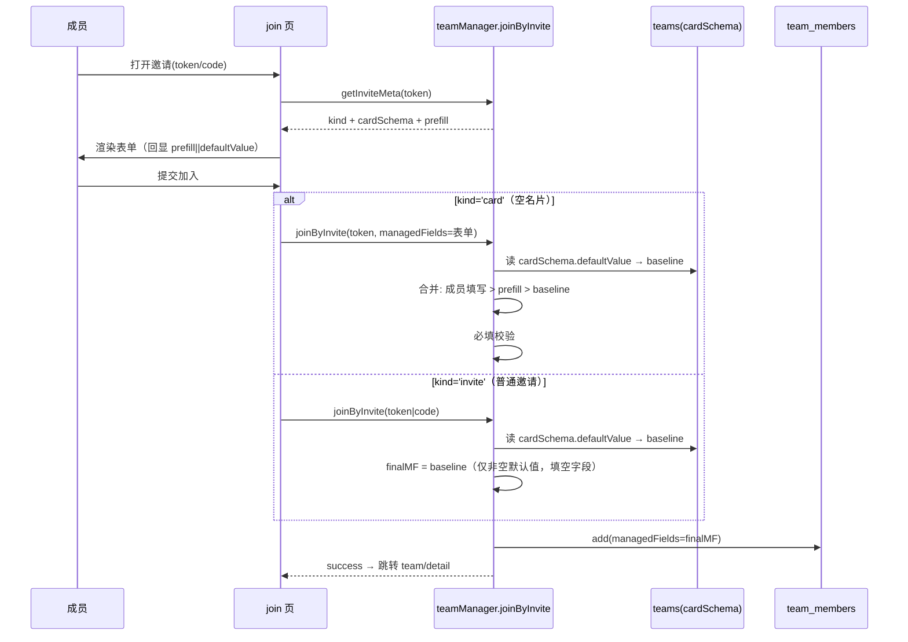

# Ncard 团队租户 · 团队可预制字段扩展（增量详细设计）

> 作者：高见远（架构师）｜类型：**增量设计**（基于现有 Phase 1 团队租户实现，非重构）｜落盘：`artifacts/team-fields-prefill-extension-design.md`
> 依赖既有设计：`team-tenant-design.md`（D2 七组织字段、D6 覆盖层模式）、`team-directory-design.md`（公开目录安全边界）、`phase1-team-tenant-mvp-design.md`
> 关联代码（已逐行核对行号）：`cloudfunctions/teamManager/index.js`、`miniprogram/utils/team.js`、`miniprogram/pages/team/{detail,join}.{js,wxml}`、`miniprogram/pages/edit/index.js`、`miniprogram/pages/preview/index.js`

---

## 0. 增量目标与范围

| 维度 | 现状（Phase 1 MVP） | 本增量目标 |
|------|---------------------|------------|
| 可预制字段集 | 7 个组织字段（company/department/position/phone/email/address/website） | **9 个逻辑字段**，新增 `wechatOfficial`、`intro`（不含头像/姓名） |
| 预制作用范围 | 仅「空名片邀请」`kind='card'` 流，经 `team_invites.prefill` 下发 | **任意成员加入**（`kind='invite'` 普通邀请 或 `kind='card'` 空名片）均自动继承团队 `cardSchema.defaultValue` 基线 |
| 存储真源 | `teams.cardSchema[].defaultValue` | 仍复用 `cardSchema.defaultValue`，**不新增** teams 公共字段存储 |
| 安全边界 | 非空覆盖/空不覆盖；非成员 `stripSchemaDefaults` 剔除 defaultValue；公开目录仅 三组织字段 + 白名单 | 延续并扩展：新增 `intro` 可随 `visible` 进公开目录；`wechatOfficial`（含二维码）默认不进公开目录 |

**明确不做**：① 头像、姓名仍不可团队预制；② website 预制沿用 `managedFields.website`（扁平），不碰 `companyWebsite`（card 对象字段）；③ 个人经历（experiences）等由个人 card 处理，不纳入。

---

## A. 增量数据模型

### A.1 `team_members.managedFields` 新字段集与存储结构

**推荐方案：扁平化（与现有 7 个标量字段保持一致），将 `wechatOfficial` 拆为两个标量 key。**

理由：现有 6+ 处逻辑（`emptyFields` / `sanitizeManagedFields` / `filterManagedByVisible` / `mergeCardWithTeam` / `getCardsTeams` 的 org 抽取 / `getTeamPublicDirectory`）全部假设 `managedFields` 为「扁平 `string→string`」结构。若改为嵌套对象 `wechatOfficial:{name,qrcode}`，上述每处都需特判，侵入面大、易遗漏。扁平化只需在 `emptyFields`、`sanitizeManagedFields` 的 key 列表、`mergeCardWithTeam` 增加两段合并即可，改动最小、最不易出错。

> 备选方案（不推荐）：`managedFields.wechatOfficial={name,qrcode}` 嵌套对象——语义更直观，但需改造全部扁平读写路径，且 `filterManagedByVisible`/`stripSchemaDefaults` 的白名单遍历逻辑需重写，风险高。

**目标 managedFields 完整结构（10 个 key，逻辑上 9 个预制字段）：**

```js
// teamManager/index.js — emptyFields() 改造后
function emptyFields() {
  return {
    // —— 原有 7 个组织字段（不变）——
    company: '', department: '', position: '',
    phone: '', address: '', website: '', email: '',
    // —— 新增 3 个 key（wechatOfficial 拆为 name/qrcode）——
    wechatOfficialName: '',     // 公众号名称（文本）
    wechatOfficialQrcode: '',   // 公众号二维码 cloud:// fileID 字符串
    intro: ''                   // 业务简介（覆盖 card.businessIntro）
  }
}
```

| key | 类型 | 含义 | 合并目标（card 字段） | 非空覆盖规则 |
|-----|------|------|----------------------|--------------|
| `company`…`website`/`email`（7 个） | string | 原有组织字段 | 同名 `card.*` | 非空覆盖、空不覆盖（不变） |
| `wechatOfficialName` | string | 公众号名称 | `card.wechatOfficial.name` | 非空覆盖 |
| `wechatOfficialQrcode` | string(`cloud://…`) | 公众号二维码 fileID | `card.wechatOfficial.qrcode` | 非空覆盖 |
| `intro` | string | 业务简介 | `card.businessIntro` | 非空覆盖 |

### A.2 `teams.cardSchema` 新 key 集与 `defaultValue` 语义

`cardSchema` 仍为 `{ key, label, visible, required, defaultValue }[]`。**新增 3 个 entry**（实际 10 个 entry；`wechatOfficial` 在存储层拆为 `wechatOfficialName`/`wechatOfficialQrcode` 两个 entry）。`defaultValue` 语义不变：字符串、写入时 `trim`、按 key 截断（`intro`/`wechatOfficialQrcode` 截断上限放宽，见 D）。

`defaultCardSchema()` 改造后（节选新增部分）：

```js
function defaultCardSchema() {
  return [
    // …原有 7 个 entry（894–900）保持不变…
    { key: 'website', label: '网址', visible: false, required: false, defaultValue: '' },
    // —— 新增（默认 visible:false，遵循隐私优先；owner 自行开启）——
    { key: 'wechatOfficialName',  label: '公众号名称', visible: false, required: false, defaultValue: '' },
    { key: 'wechatOfficialQrcode',label: '公众号二维码', visible: false, required: false, defaultValue: '' },
    { key: 'intro',              label: '业务简介',   visible: false, required: false, defaultValue: '' }
  ]
}
```

| entry key | label | 默认 visible | defaultValue 上限 | 说明 |
|-----------|-------|--------------|------------------|------|
| `wechatOfficialName` | 公众号名称 | false | 200 | 仅预填名称文本 |
| `wechatOfficialQrcode` | 公众号二维码 | false | 300 | 存 `cloud://` fileID（owner 上传团队公共二维码） |
| `intro` | 业务简介 | false | 500 | 预填业务简介文本 |

### A.3 是否在 `teams` 上新增「团队公共字段」存储

**推荐：不新增，仍复用 `teams.cardSchema[].defaultValue` 作为唯一真源。**

- 既有实现中 owner 在 detail 页「团队名片配置」设置的 `defaultValue` 已通过 `saveTeamCardSchema` 落库到 `teams.cardSchema`（`teamManager:210–222`）。
- 新增字段只是把 `cardSchema` 的 key 集从 7 扩到 10，无需新建集合/字段，避免双真源不一致。
- 普通邀请流的「baseline 注入」直接读取 `team.cardSchema[].defaultValue`，与空名片流的 `prefill`（本就由 `defaultValue` 打包而来）同源，逻辑统一。

---

## B. 安全边界

### B.1 非成员分支 `stripSchemaDefaults`（F13）— 自动覆盖，无需改动

`getTeam` 非成员白名单分支在 `teamManager:541` 调用 `stripSchemaDefaults(cardSchema)`，该函数（`:949–956`）对 `schema` 整体 `map` 输出 `{key,label,visible,required}`，**不含 `defaultValue`**。由于新增 3 个 key 已并入 `cardSchema`，它们会**自动**被剔除 `defaultValue`——非成员拿不到 owner 预填的公众号名称/二维码/简介内容。✅ 仅需在回归时确认新 key 同样不泄露。

### B.2 公开目录（`getTeamPublicDirectory`）— 明确白名单

当前 `PUBLIC_SAFE`（`:608`）仅放行 `position/company/department`，且 `phone/email/address/website` 即便 `visible` 也强制不进目录（`:604` 注释与 `:615–617` 实现）。

**本增量推荐：**
- `intro`：**可随 `visible` 进公开目录**（业务简介本就该公开）。将 `intro:true` 加入 `PUBLIC_SAFE`，并在 `directory` 映射（`:609–621`）新增 `intro` 字段，取值 `visMap.intro ? (mf.intro || '') : ''`（仅取团队托管 `managedFields.intro`，不从个人 `card.businessIntro` 透出，保持与个人数据隔离）。
- `wechatOfficial`（`wechatOfficialName`/`wechatOfficialQrcode`）：**默认不进公开目录**，与现有 private 语义一致（含二维码，仅团队成员可见）。**不**加入 `PUBLIC_SAFE`。其在团队视图内的可见性仍由 `cardSchema.visible` + `filterManagedByVisible` 控制（成员/owner 上下文）。

### B.3 非空覆盖 / 空不覆盖（D6 覆盖层语义）

所有新增字段严格遵循既有规则（`team.js:97–108`）：`managedFields` 中**非空**才覆盖同名 card 字段；**空值不覆盖**（个人 card 同名字段自然透出）。baseline 注入时仅写入「非空 `defaultValue`」的 key，空 `defaultValue` 的 key 保持空，从而个人值可透出——实现「团队统一默认值、加入即继承、**owner 设了默认值的字段强制覆盖个人值、未设字段个人透出**（G3 已确认：强制覆盖）」。

---

## C. 作用范围升级实现方案

### C.1 `joinByInvite` 重构：两种邀请均注入团队默认值基线

现状（`teamManager:256–271`）：`finalMF` 初始化为 `emptyFields()`（全空）；仅 `kind==='card'` 分支用 `userMF/prefill/defaultValue` 合并，`kind==='invite'` 分支 `finalMF` 始终全空（成员用个人 card，团队默认值不生效）。

**改造**：在分支判断前，先由 `team.cardSchema.defaultValue` 计算 `baseline`（仅含非空默认值）；两个分支都基于 `baseline` 填充，**不覆盖成员已有值**。

```js
// teamManager/index.js — joinByInvite 中段（替换原 256–271）
const schema = (teamRes.data && teamRes.data.cardSchema) || defaultCardSchema()
const ALL_KEYS = schema.map(f => f.key)            // 现 10 个 key
// 团队统一默认值基线：仅非空 defaultValue 写入（空留空 → 个人 card 透出）
const baseline = {}
schema.forEach(f => { const d = (f.defaultValue || '').trim(); if (d) baseline[f.key] = d })

let finalMF = emptyFields()                         // 含 10 key，初始全空
if (inv.kind === 'card') {
  const userMF = sanitizeManagedFields(event.managedFields || {})
  const prefill = inv.prefill || {}
  const requiredKeys = schema.filter(f => f.required).map(f => f.key)
  ALL_KEYS.forEach(k => {
    const def = baseline[k] || ''
    const pf  = (prefill[k] || '').trim()           // owner 在空名片邀请里打包的预填
    const usr = (userMF[k] || '').trim()            // 成员填写
    finalMF[k] = usr || pf || def                   // 优先级：成员 > prefill > 团队默认值
  })
  const missing = requiredKeys.filter(k => !(finalMF[k] || '').trim())
  if (missing.length) return { success: false, error: 'MISSING_REQUIRED', fields: missing }
} else {
  // 普通邀请(kind='invite')：成员用已有名片加入 → 团队默认值强制覆盖个人值（G3 已确认）
  // owner 设了非空 defaultValue 的字段，成员加入即以团队值为准，覆盖个人 card 同名字段；
  // baseline 仅含非空默认值，故 owner 未设的字段仍留空、个人 card 值透出
  ALL_KEYS.forEach(k => { if (baseline[k]) finalMF[k] = baseline[k] })
}
// 后续 addRes / 维护 teamIds + memberCount / usedCount 逻辑（273–318）不变
```

要点：
- `sanitizeManagedFields`（`:879–888`）随 key 列表扩展后，自动放行新增 3 个 key，无需在 `joinByInvite` 内特判。
- 普通邀请分支**不做必填校验**（成员凭已有名片加入，无表单）；必填仅在 `kind==='card'` 空名片分支校验（保持现状）。
- `intro`/`wechatOfficialName` 为文本，baseline 直接注入；`wechatOfficialQrcode` 的 `defaultValue` 是团队公共二维码 fileID，baseline 同样注入（成员 inherit 团队官方二维码）。

### C.2 owner 修改 `defaultValue` 后回填存量成员（可选 P2）

**G7 已确认：纳入本期（必做，非 P2 可选）**。owner 操作 `applyCardSchemaDefaultsToMembers`：遍历团队 `active` 成员，对每条 `managedFields` 用当前 `team.cardSchema.defaultValue` 填充**仍为空的** key（不覆盖成员已填值），批量 `update`。须在 `exports.main` 路由（`:53` 后）注册，并校验 `team.ownerOpenId === OPENID`。作为 owner 配置弹层里的「应用到全部成员」按钮触发。

### C.3 调用时序（mermaid）



---

## D. 后端改动点清单（`cloudfunctions/teamManager/index.js`）

| # | 函数 / 位置 | 行号 | 改动内容 |
|---|-------------|------|----------|
| D1 | `emptyFields()` | `866–876` | 新增 `wechatOfficialName:''`、`wechatOfficialQrcode:''`、`intro:''` 三个 key |
| D2 | `sanitizeManagedFields()` | `882` | `keys` 数组追加 `'wechatOfficialName','wechatOfficialQrcode','intro'`（保持扁平 string 规整） |
| D3 | `defaultCardSchema()` | `892–902` | 新增 3 个 entry（默认 `visible:false,required:false,defaultValue:''`） |
| D4 | `CARD_SCHEMA_KEYS` | `905` | 追加 `'wechatOfficialName','wechatOfficialQrcode','intro'`（驱动 `sanitizeCardSchema`/`sanitizePrefill`/`filterManagedByVisible` 自适应） |
| D5 | `sanitizeCardSchema()` | `906–924` | 随 `CARD_SCHEMA_KEYS` 自动包含新 key；`defaultValue` 截断按 key 放宽：`intro`→`slice(0,500)`，`wechatOfficialQrcode`→`slice(0,300)`，其余保持 `200` |
| D6 | `sanitizePrefill()` | `927–935` | 随 `CARD_SCHEMA_KEYS` 自动包含新 key；`intro` 预填截断放宽至 `500` |
| D7 | `filterManagedByVisible()` | `938–946` | 随 `CARD_SCHEMA_KEYS` 自动包含新 key（成员/owner 视图按 `visible` 过滤，无需特判） |
| D8 | `stripSchemaDefaults()` | `949–956` | **无需改动**——对 schema 整体 map，新 key 自动剔除 `defaultValue`（F13 安全边界自动覆盖） |
| D9 | `joinByInvite()` | `256–271` | 按 **C.1** 重构：前置计算 `baseline`，两个分支均注入团队默认值基线 |
| D10 | `applyCardSchemaDefaultsToMembers`（本期必做） | 路由 `:53` + 新增函数 | 新增 owner action：回填存量成员空字段（不覆盖已填值），校验 `team.ownerOpenId === OPENID` |
| D11 | `getTeamPublicDirectory()` | `604–621` | `PUBLIC_SAFE`（`:608`）追加 `intro:true`；`directory` 映射（`:612–619`）新增 `intro` 字段（仅取 `mf.intro`）；`wechatOfficial*` **不**入目录 |
| D12 | `getCardTeams()` | `742` | **无需改动**——`filterManagedByVisible` 随 D4/D7 自动返回新 key（成员可见上下文） |
| D13 | `getCardsTeams()` | `791–794` | **无需改动**——名片夹仅展示组织三字段，新增字段不在此透出（符合既有「名片夹不带联系方式」约束） |

> 说明：`updateMemberFields`（`:346`）经 `sanitizeManagedFields` 自动支持新 key；`saveTeamCardSchema`（`:219`）经 `sanitizeCardSchema` 自动校验新 key。

---

## E. 前端改动点清单

### E.1 合并层 `miniprogram/utils/team.js` — `mergeCardWithTeam`（`:92–115`）

在 website→companyWebsite（`:104–108`）之后追加：

```js
// 新增：团队 intro 覆盖业务简介
if (mf.intro) merged.businessIntro = mf.intro
// 新增：团队公众号（名称 + 二维码）覆盖 card.wechatOfficial
if (mf.wechatOfficialName) {
  const base = (typeof merged.wechatOfficial === 'object' && merged.wechatOfficial) || {}
  merged.wechatOfficial = Object.assign({}, base, { name: mf.wechatOfficialName })
  if (mf.wechatOfficialQrcode) merged.wechatOfficial.qrcode = mf.wechatOfficialQrcode
}
// teamManaged 标记（:110–113）追加 intro / wechatOfficialName
merged.teamManaged = !!(
  mf.company || mf.department || mf.position || mf.phone ||
  mf.address || mf.email || mf.website || mf.intro || mf.wechatOfficialName
)
```

### E.2 团队名片配置 `detail.js` + `detail.wxml`（owner）

| 文件 | 位置 | 改动 |
|------|------|------|
| `detail.js` | `onSchemaDefaultInput :241–248` | 复用：对已扩展的 `cardConfigDraft` 通用生效（文本/文本域走此 handler） |
| `detail.js` | 新增 `onSchemaQRUpload` | 针对 `wechatOfficialQrcode`：上传二维码到云存储，写回 `cardConfigDraft[idx].defaultValue = fileID` |
| `detail.js` | `onShareCard :268–286` | 复用：遍历 `cardConfigSchema` 打包 `prefill`（`:272–277` 自动包含新 key 的非空 `defaultValue`，含二维码 fileID） |
| `detail.wxml` | `schema-row :180–189` | 按 `item.key` 条件渲染：① `wechatOfficialQrcode` → 上传按钮 + 二维码预览（非文本 input）；② `intro` → `textarea`（maxlength 500）；③ 其余 → 现有 `input`（maxlength 200） |

### E.3 加入表单 `join.js` + `join.wxml`

| 文件 | 位置 | 改动 |
|------|------|------|
| `join.js` | `_loadInviteMeta :47–52` | 复用：通用初始化 `form[wechatOfficialName/wechatOfficialQrcode/intro]`（回显 `prefill||defaultValue`） |
| `join.js` | `onFieldInput :69–72` | 复用：textarea/文本均按 `data-key` 写 `form[key]` |
| `join.js` | `join`（card 分支校验）`:80–86` | 复用：`required && visible && 空` 校验自动覆盖新 key（textarea 的 `intro`、二维码 `wechatOfficialQrcode` 由 baseline 预填可过必填） |
| `join.wxml` | `form-group :17–27` | 按 `item.key` 条件渲染：① `wechatOfficialQrcode` → 只读二维码预览（`form[item.key]` 为 fileID，"团队统一二维码不可修改"）+ 提示；② `intro` → `textarea`；③ 其余 → 现有 `input`（placeholder 逻辑 `:21` 复用） |
| `join.wxml` | 普通邀请分支 `:38–56` | **无需改动**——普通邀请无表单，baseline 由后端注入 |

### E.4 编辑页团队覆盖锁定 `edit/index.js` + `edit.wxml`

`edit/index.js` `_loadTeamManagedFields`（`:721–737`）追加（映射至 edit 页字段标识）：

```js
if (mf.company)   map.company = t.name
if (mf.position)  map.position = t.name
if (mf.website)   map.companyWebsite = t.name
// —— 新增 ——
if (mf.intro)            map.businessIntro = t.name   // 锁定「业务简介」编辑
if (mf.wechatOfficialName) map.wechatOfficial = t.name // 锁定「公众号」整组编辑（名称+二维码）
```

`edit.wxml` 复用现有 `managedFieldMap` 禁用逻辑：当 `managedFieldMap.businessIntro` / `managedFieldMap.wechatOfficial` 存在时，对应输入/上传置灰并提示「由团队「<团队名>」统一管理」。

---

## F. 增量任务列表（有序 · 含依赖 · 涉及文件 · 测试要点）

> 以下为交付工程师的实现任务（文档级，非工具 task）。依赖关系：所有任务依赖 T1（字段集底座）。

| 任务 | 名称 | 依赖 | 涉及文件 | 优先级 |
|------|------|------|----------|--------|
| **T1** | 后端字段集底座扩展 | — | `cloudfunctions/teamManager/index.js`（D1–D8） | P0 |
| **T2** | 后端 joinByInvite 作用范围升级 + 回填 action（applyCardSchemaDefaultsToMembers，本期必做） | T1 | `cloudfunctions/teamManager/index.js`（D9–D10） | P0 |
| **T3** | 后端公开目录适配（intro 入、wechatOfficial 出） | T1 | `cloudfunctions/teamManager/index.js`（D11） | P1 |
| **T4** | 前端合并层 + 编辑页团队锁定 | T1 | `miniprogram/utils/team.js`、`miniprogram/pages/edit/index.js`、`miniprogram/pages/edit/*.wxml` | P1 |
| **T5** | 前端配置/加入表单扩展（公众号名称+二维码、intro） | T1 | `miniprogram/pages/team/detail.js`、`detail.wxml`、`join.js`、`join.wxml` | P1 |
| **T6** | 回归测试与联调（含安全回归） | T2,T3,T4,T5 | 全量 + 手工/单测 | P0（收尾） |

**测试要点（回归）：**

1. **普通邀请预制生效**：owner 设 `defaultValue`（如 company="Acme"、intro="…"、wechatOfficialName="官方号"）→ 成员凭 `kind='invite'` 加入 → 个人 card 该字段为空时，团队视图（preview `teamCardView`）正确显示继承值；个人 card 已有值（非空 managedFields 之外）仍透出。
2. **空名片邀请预制生效**：owner 发 `kind='card'`，`prefill` 含新 key → 成员表单回显（含二维码预览）→ 提交后 `managedFields` 正确含新 key；必填新字段拦截生效。
3. **公开目录安全**：开启目录后，成员 `intro`（`visible:true`）出现在公开目录；`wechatOfficial*` 绝不出现在公开目录；`phone/email/address/website` 依旧不出现。
4. **非成员不泄露 defaultValue**：非成员 `getTeam` 返回的 `cardSchema` 各 `defaultValue` 为空（F13 自动覆盖，含新 key）；`getInviteMeta` 对 `kind='invite'` 无 `prefill`（不放新 key 预填）。
5. **merge 展示正确**：preview「团队名片视图」中 `intro` 覆盖 `businessIntro`、`wechatOfficial.name/qrcode` 正确合并到 `card.wechatOfficial`；`teamManaged` 标记正确。
6. **edit 页禁用提示正确**：成员在团队托管 `intro`/`wechatOfficial` 时，编辑页对应项置灰并提示团队名；个人可改字段不受影响。
7. **非空覆盖/空不覆盖**：清空某成员 `managedFields.intro` 后，预览回退到个人 `businessIntro`；填值后覆盖。

---

## G. 风险与待确认事项

| # | 事项 | 建议 / 现状 | 待确认 |
|---|------|------------|--------|
| G1 | 团队预制 `wechatOfficialQrcode` 是否预存团队公共二维码 fileID | **已确认（v1）：owner 在「团队名片配置」上传一张团队公共二维码到云存储，将其 fileID 存入 `cardSchema.defaultValue`，成员 inherit 该 fileID（只读，不可替换）。** | — |
| G2 | `intro` 字数限制 | `defaultValue` 截断放宽为 500；配置弹层 `textarea` maxlength=500；公开目录展示不限。 | 业务简介是否需更长（如 1000）？ |
| G3 | 普通邀请成员已有同名组织字段时 baseline 是否强制覆盖 | **已确认：强制覆盖**。团队 `cardSchema` 中 `defaultValue` 非空的字段，成员加入即以团队值为准（写入/覆盖 `managedFields`），无视个人 card 原有值；`defaultValue` 为空的字段仍留空、个人值透出。空名片(`kind='card'`)流成员仍可改表单值，成员改后优先于 baseline。 | — |
| G4 | 普通邀请分支不做必填校验 | 成员凭已有名片加入，无表单故不校验 `required`；若 owner 设了必填字段，普通邀请成员不会因此被拦截（仅空名片流拦截）。 | 是否要对普通邀请也强制补齐必填？当前选"不强求"。 |
| G5 | 二维码 fileID 防注入 | `sanitizeManagedFields` 对 `wechatOfficialQrcode` 建议额外校验前缀 `cloud://`（非 fileID 则清空），避免任意字符串写入。 | 是否加入前缀白名单校验？建议加。 |
| G6 | 存量数据兼容 | 旧 `managedFields`/`cardSchema` 无新 key；`emptyFields()`/`sanitize*`/merge 均对缺失 key 容错（读不到即 ''），**向后兼容**，无需迁移脚本。 | — |
| G7 | 回填 action（C.2）是否本期实现 | **已确认：纳入本期（必做）**。实现 `applyCardSchemaDefaultsToMembers`，owner 改默认值后可一键回填存量成员空字段（不覆盖已填值）。见 D10 / T2。 | — |

---

*设计稿结束。工程师依 §D/§E 改动点 + §F 任务顺序落地；QA 依 §F 测试要点与 §B 安全边界做回归。所有行号基于核对时的代码现状，如后续代码变动请以实际为准。*
